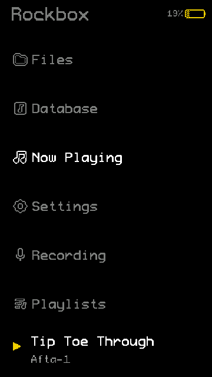
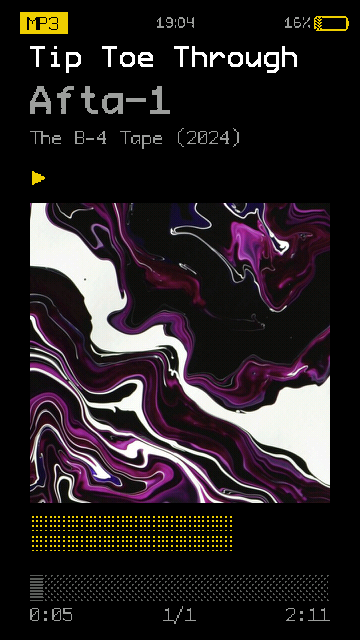

# FleshAndBones — AP80 Pro Max

**FleshAndBones** is a high-contrast, amber-on-black Rockbox theme built for the **Hidizs AP80 Pro Max** (360×640 portrait touchscreen). It is a faithful port of nicnic's *FleshAndBones* — itself based on Jihoon Kim's *OneBit_OLED* and chronicallyoffline's *OneBit_VFD* — re-laid-out natively for the device's tall 249 dpi panel, with every bitmap and font scaled ×1.5 from the original 320×240 assets so the classic pixel grid and proportions are preserved.

## Previews

| Main menu | Now playing |
|:---------:|:-----------:|
|  |  |

## Features

- **Full WPS layout** — track title / artist / album, 300×300 album-art box, dithered progress bar, peak meter, and graphic volume bar
- **Custom header** — codec tag (`MP3`, `FLAC`, …), clock, battery percentage + 11-frame battery icon, all drawn by the skin (status bar disabled)
- **Lock screen** — big clock, now-playing info, time remaining, plus charging / low-battery states
- **Playback indicators** — play, shuffle, repeat and seek icons in the play screen
- **1-bit monochrome iconset** for the file browser and viewers (`modone.bmp` / `modone_viewer.bmp`)
- **ProFontIIx + Monogram fonts** at every UI size, preloaded for smooth rendering
- **Touch-friendly lists** — row pitch tuned to the panel (font 26 + list padding 57 = 83 px), exactly seven rows filling the screen
- **Portrait-native WPS/SBS** authored directly at 360×640 — no letterboxing or scale artifacts

## Contents

```
.Rockbox/
├── fonts/    # ProFontIIx (23/26/33/35/44/50) + 11-monogram
├── icons/    # modone iconset (main + viewers)
├── themes/   # FleshAndBones.cfg (colours, fonts, list padding)
└── wps/      # FleshAndBones.wps / FleshAndBones.sbs + bitmaps
```

## Installation

1. Copy the **contents** of `.Rockbox/` (`fonts`, `icons`, `themes`, `wps`) into the `.rockbox` folder on your AP80 Pro Max, merging with any existing files.
2. On the device go to **Settings → Theme Settings → Theme** and select **FleshAndBones**.
3. Restart or re-apply the theme if the skin does not refresh immediately.

> **Album art:** the skin prefers an image file (`cover.jpg` / `cover.png`) sitting next to your tracks and crops it into a 300×300 box.

## Credits

- **Theme:** FleshAndBones by nicnic \<me@nicnic.cc\>
- **Based on:** *OneBit_OLED* by Jihoon Kim · *OneBit_VFD* by chronicallyoffline \<ben@chronicallyoffline.xyz\>
- **Thanks to:** Jihoon Kim, Chuck Lardo and D0-0K for inspiration and for code/assets reused under CC-BY-SA and GPL v3 respectively
- **AP80 Pro Max port:** colours, fonts, iconsets and 360×640 layout — v1.0 (2026-04-09)

## License

CC BY-SA 3.0 — reused code/assets remain under CC BY-SA 3.0 / GPL v3 as noted in the source files.
