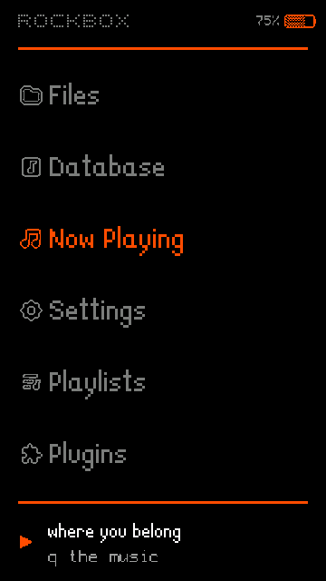
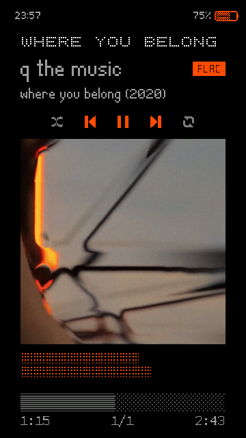
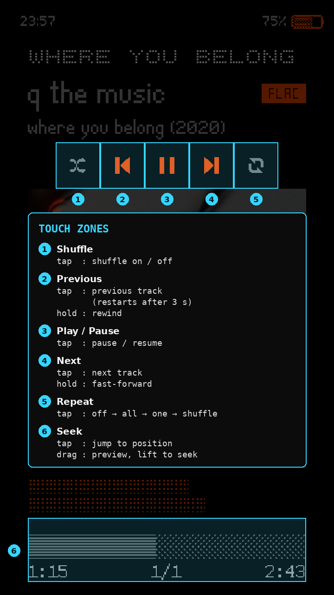
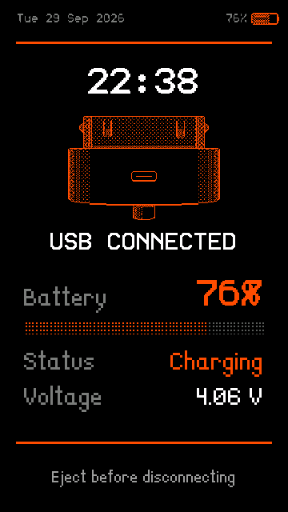

# FleshAndBones Remix — AP80 Pro Max

**FleshAndBones Remix ** is a high-contrast Rockbox theme with vacuum-tube orange accents on black, built for the **Hidizs AP80 Pro Max** (360×640 portrait touchscreen). It is a faithful port of nicnic's *FleshAndBones* — itself based on Jihoon Kim's *OneBit_OLED* and chronicallyoffline's *OneBit_VFD* — re-laid-out natively for the device's tall 249 dpi panel, with every bitmap and the original fonts scaled ×1.5 from the original 320×240 assets so the classic pixel grid and proportions are preserved.

## Previews

| Main menu | Now playing | Touch zones | USB connected |
|:---------:|:-----------:|:-----------:|:-------------:|
|  |  |  |  |

<sub>Screenshots rendered by the Rockbox simulator for the AP80 Pro Max. Track: [“where you belong” by q the music](https://qthemusic.bandcamp.com/track/where-you-belong) (2020) — cover art © q the music.</sub>

## Features

- **Full WPS layout** — track title / artist / album, 300×300 album-art box, dithered progress bar, peak meter, and graphic volume bar
- **Vacuum-tube orange accents** (`#FF4D00`) on pure black — battery icon, playback buttons, peak meter, codec tag, the selected item in every list and the menu's header and footer rules.
- **Dot-matrix track info** — the title in *SquareDotCombined* (also covers Japanese, Chinese and Korean), the artist and the album + year in *LanaPixel* (just the year, e.g. “(2020)”, for a single — when the album name is the same as the title), and a solid orange codec tag (`MP3`, `FLAC`, …) in *Digital-7 Mono* at the end of the artist line
- **Tactile progress bar** — tap it to jump, or drag along it and lift to seek, with a finger-sized touch zone around the bar
- **Touch transport** — small shuffle · previous · play/pause · next · repeat buttons (16–18 px glyphs, 48 px apart) centred under the track info; shuffle and repeat are grey when off and turn orange when on
- **Custom header** — clock on the left, battery percentage + 11-frame battery icon on the right, all drawn by the skin (status bar disabled)
- **Lock screen** — big clock, now-playing info, time remaining, plus charging / low-battery states
- **USB screen** — while connected to a computer: the time in the menu header's dot-matrix font (SquareDotCombined, one size up), the date, the battery level (big percentage + a dot-matrix gauge in the peak meter's style), charging status (Charging / Charged / Not charging) and battery voltage, with the eject reminder in the footer
- **Playback indicators** — the shuffle / repeat buttons show the current mode (repeat one and repeat shuffle have their own icons), and the play button turns into ◀◀ / ▶▶ while seeking
- **1-bit monochrome iconset** for the file browser and viewers (`modone.bmp` / `modone_viewer.bmp`)
- **LanaPixel main font** for the menus, file browser, settings and the now-playing footer (covers Japanese, Chinese and Korean), with the original ProFontIIx + Monogram fonts for the clock, battery percentage and labels, plus the three track-info fonts on the now-playing screen. The "Rockbox" title in the menu header uses the track title's dot-matrix font (SquareDotCombined)
- **Touch-friendly lists** — row pitch tuned to the panel (LanaPixel 42 px + list padding 37 = 79 px), exactly six rows between the header and the now playing footer, with a margin above and below them so rows scrolled by touch stop short of the orange rules
- **Portrait-native WPS/SBS** authored directly at 360×640 — no letterboxing or scale artifacts

## Contents

```
.rockbox/
├── fonts/    # LanaPixel (14/21), ProFontIIx (23/26/33/35/44/50) + 11-monogram, 35-SquareDotCombined, 47-SquareDotCombined-ASCII, 20-digital7mono
├── icons/    # modone iconset (main + viewers)
├── themes/   # FleshAndBones.cfg (colours, fonts, list padding)
└── wps/      # FleshAndBones.wps / FleshAndBones.sbs + bitmaps
```

## Installation

1. Copy the **contents** of `.rockbox/` (`fonts`, `icons`, `themes`, `wps`) into the `.rockbox` folder on your AP80 Pro Max, merging with any existing files.
2. On the device go to **Settings → Theme Settings → Theme** and select **FleshAndBones**.
3. Restart or re-apply the theme if the skin does not refresh immediately. When updating from an earlier version, select the theme again: the colours, the main font and the list padding are stored in the theme's `.cfg`, and Rockbox only reads them when the theme is applied.

> **Album art:** the skin prefers an image file (`cover.jpg` / `cover.png`) sitting next to your tracks and crops it into a 300×300 box.

## Touch controls

The first six areas are on the now playing screen; the last one is in the footer of the menus and file browser.

| Area | Tap | Hold / drag |
|---|---|---|
| 🔀 Shuffle | Shuffle on / off (orange while on) | — |
| ⏮ Previous | Previous track (restarts the current one after 3 s) | Rewind |
| ⏸ / ▶ Play/Pause | Pause / resume (resumes the last playlist when stopped) | — |
| ⏭ Next | Next track | Fast-forward |
| 🔁 Repeat | Next repeat mode: off → all → one → shuffle (orange while on) | — |
| Progress bar | Jump to that position | Drag to preview, lift to seek |
| ▶ / ⏸ icon in the now playing footer (menus) | Pause / resume (resumes the last playlist when stopped) | — |

- The icons stay small, but each button has a larger invisible 48×50 px tap target (46×50 for the footer icon in the menus). The seek zone spans exactly the bar's width, so where you touch maps 1:1 to the track position. It reaches from the gap above the bar down through the time row (~7 mm tall), so you don't have to hit the 26 px bar itself.
- The centre icon shows ⏸ while playing and ▶ when paused or stopped. While seeking it shows the theme's ◀◀ / ▶▶ arrows.
- Previous/next go through the same path as the hardware buttons, so skip length, cuesheets and Party Mode are respected.
- Touch targets are disabled on the lock screen and while the volume bar is shown; the footer icon ignores taps while the keys are locked.
- Shuffle and repeat change the same settings as **Settings → Playback Settings**. A-B repeat is not part of the cycle because the AP80 build of Rockbox has no A-B repeat.
- Requires **Settings → General Settings → Display → Touchscreen Settings → Touchscreen Mode: Point**, which is the default on this player. The theme does not change this setting.
- Checked with `checkwps` for the `hidizsap80max` target and tested with touch input in the AP80 Pro Max simulator (Rockbox `8f38274e`). It still needs testing on a physical device.

## Credits

- **Theme:** FleshAndBones by nicnic \<me@nicnic.cc\>
- **Based on:** *OneBit_OLED* by Jihoon Kim · *OneBit_VFD* by chronicallyoffline \<ben@chronicallyoffline.xyz\>
- **Thanks to:** Jihoon Kim, Chuck Lardo and D0-0K for inspiration and for code/assets reused under CC-BY-SA and GPL v3 respectively
- **AP80 Pro Max port:** colours, fonts, iconsets and 360×640 layout — v1.0 (2026-04-09)
- **Fonts:** *LanaPixel* (main font and artist) by eishiya · *SquareDot* and *Digital-7 Mono* by Sizenko Alexander (Style-7) · *SquareDotCombined* (SquareDot plus CJK glyphs) from ottoptj's *CrazyBitMono*. The `.fnt` files and the vacuum-tube orange come from mr-f0xx's *CrazyBit Tube Edition* for the AP80 Pro Max; `35-SquareDotCombined.fnt` is a ¾-size version made from its `47-SquareDotCombined.fnt` (the same dots on a 3 px grid), and `47-SquareDotCombined-ASCII.fnt` (the USB screen clock) is that font cut down to its printable ASCII characters.

## License

CC BY-SA 3.0 — reused code/assets remain under CC BY-SA 3.0 / GPL v3 as noted in the source files. The bundled LanaPixel, SquareDot and Digital-7 Mono fonts keep their own licences: LanaPixel is CC BY 4.0; SquareDot and Digital-7 Mono are Style-7 freeware for personal use.
